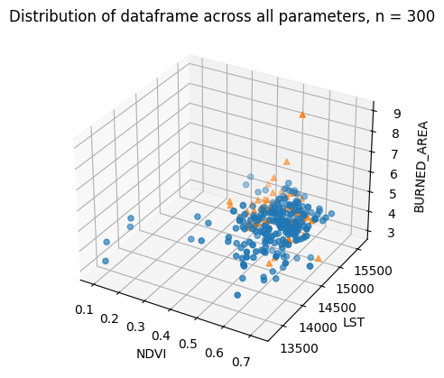

# wildfire-prediction-ML
### Eli Hiton

## Links to original article and git repository
[Original article](https://www.sciencedirect.com/science/article/abs/pii/S0379711218303941)

[Github repository with data](https://github.com/ouladsayadyounes/Wildfires)

## Introduction
Wildfires are an annually increasing threat. Fires are sometimes not responded to until a 911 call alerts firefighters. Remote detection systems coupled with machine learning models could detect and alert authorities before the fire gets too large. Oulad Sayad et al. created a database along three paramaters of interest and labeled the points as fire or no fire. All of their measurements are attained through satellite imaging. They looked at NDVI, a measurement of vegetation cover; LST, land surface temperature; and burn area (the database on the github that I pulled from has been changed slightly from the database they analyze in their paper). In their paper, they got very good results from Neural Networks and SVMs (98.89% and 97.22% average accuracy respectively. In my research, I explore the effectiveness of K-nearest neighbors and random forest algorithms to solve the same classification problem. 

## Methods
I used a shuffled 6-fold split for each algorithm. I plotted the model's accuracy over a range of hyperparameters and decided to set the KNN classifier at 18 neighbors weighted by distance. Using a similar method, I chose to use 330 trees in the random forest. I noticed both of my models were performing poorly at correctly labeling "fire" queries. The figures below show how crowded the "fire" points are by the "no_fire" values.

In the original paper, they had a class split of 386:418 fire:no_fire. Conversely, the dataset I was using had a split of 386:1327 fire:no_fire. I hypothesized that one of the reasons my models might be performing poorly was because of this class imbalance. To hopefully rectify this, I ran the models again but downsampled the no_fire class to 30% of its size, bringing it roughly in line with the proportion we expect from a random fold of the original dataset.

## Results
In addition to measuring accuracy, I am choosing to use the generalized $f_{\beta}$ metric with $\beta=2$ to weight recall more heavily. This places more emphasis on the model's ability to correctly identify a "fire" instance as a fire. I'm assuming that the cost of verifying a wildfire's presence is much lower than the cost of a wildfire being missed or ignored by a deployed model. 

